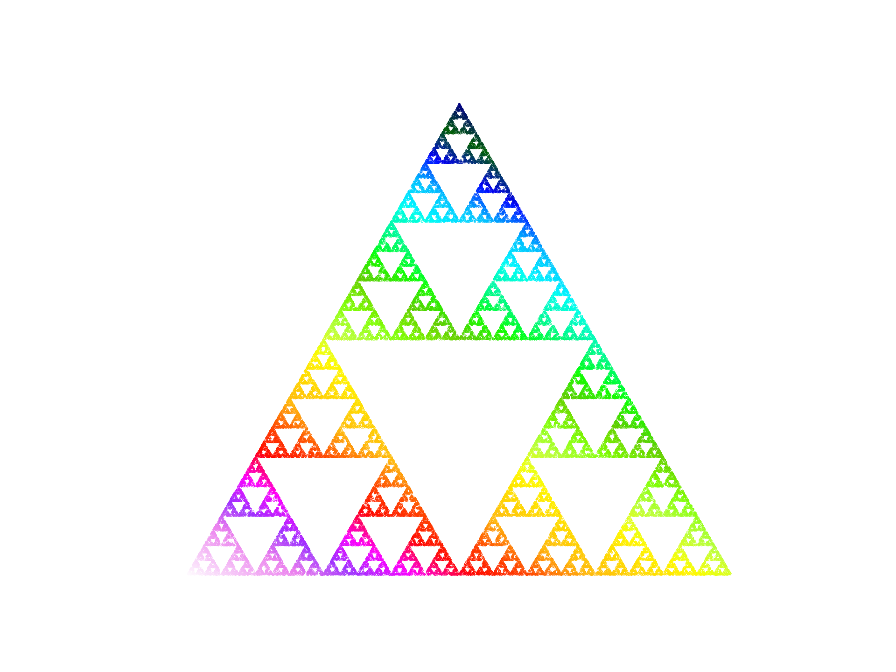
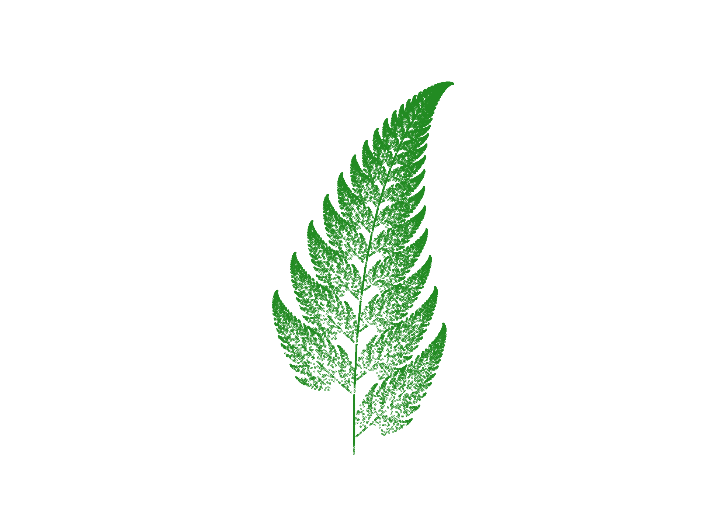
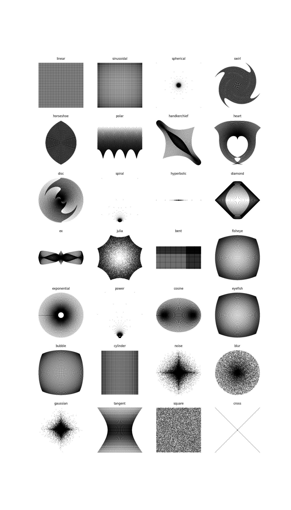
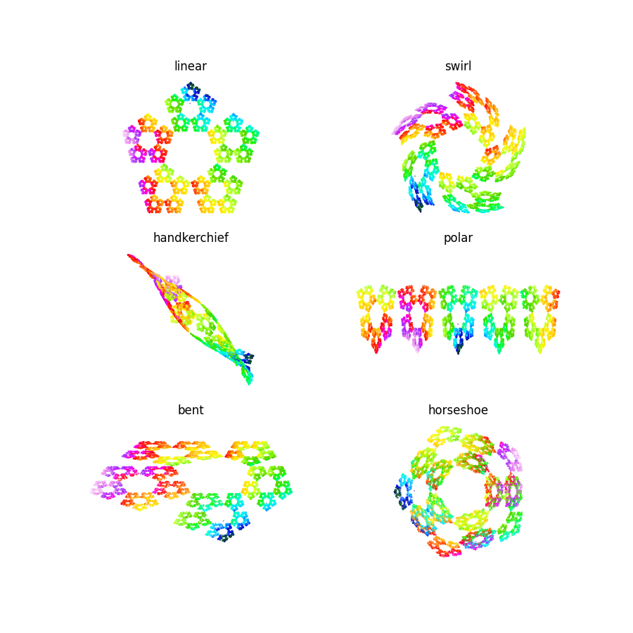
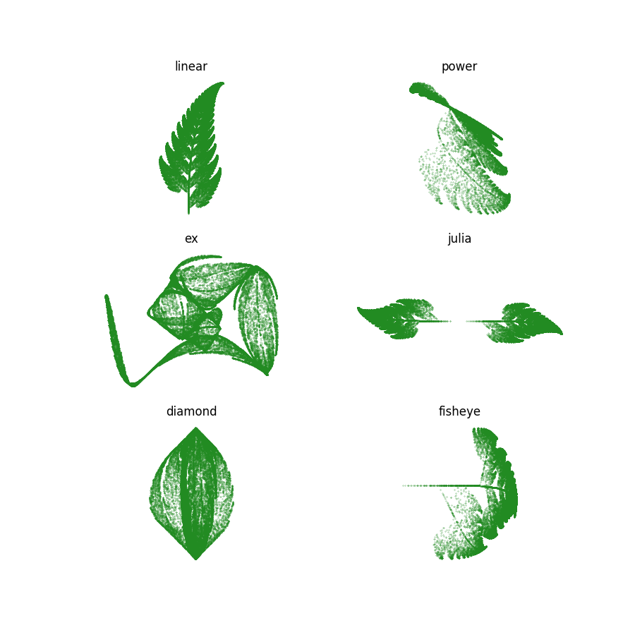
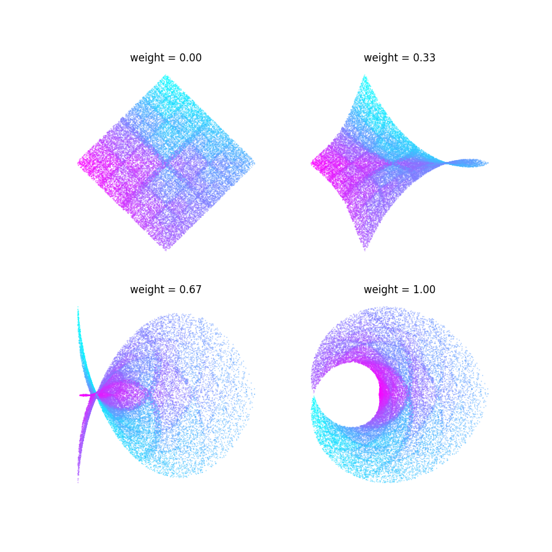

# Object-Oriented Programming Demo
Demonstration of object-oriented principles for KDA

## About the program
In this coding project, we build fractals point by point according to well-known algorithms to create some pretty plots.

### The Chaos Game
First, we have the Chaos Game, where the fractals are restricted to the interiors of $n$-sided polygons ($n$-gons). We select a random starting point in the interior of the shape, and with a few random selections of vertices and placing points down according to a specific ruleset, the fractal pattern is produced over many iterations. This procedure is carried out in the program `chaos_game.py`, and lets us create figures like the one below, where $n = 3$. See `figures/` folder for more plots.

### The Barnsley Fern
Another type of fractal is the [Barnsley Fern](https://en.wikipedia.org/wiki/Barnsley_fern), where the pattern generated resembles a leaf with each branch being structurally identical to the full leaf.

### Adding your own fractals
Both of these fractal variations inherit from the base class `Fractal`, which can be modified to generate other fractal types. 

### Warping effects
The program `variations.py` specifies a number of 2D transformations, displayed in terms of their effect on a grid below:

The transformations can be applied to our Fractal objects as well, warping the plots in various ways:

We can even make linear combinations of various transformations to combine different warpings, or to change the intensity of the effect:

## How to run
Create Chaos Game plots by running

``uv run chaos_game.py``

Create the Barnsley Fern by running 

``uv run barnsley_fern.py``

Generate the transformation catalog and warped Chaos Game plots by running

``uv run variations.py``

Run simple tests with

``uv run pytest``

## Helpful sources
The math and algorithm behind the Chaos Game (and a few more variants of it) are described in detail [here](https://thewessens.net/ClassroomApps/Main/chaosgame.html), as well as on the [Chaos Game](https://en.wikipedia.org/wiki/Chaos_game) and [Barnsley Fern](https://en.wikipedia.org/wiki/Barnsley_fern) Wikipedia pages. The definitions of the various transformation functions on a point $(x, y)$ can be found in the appendix of [this paper](https://flam3.com/flame_draves.pdf).
